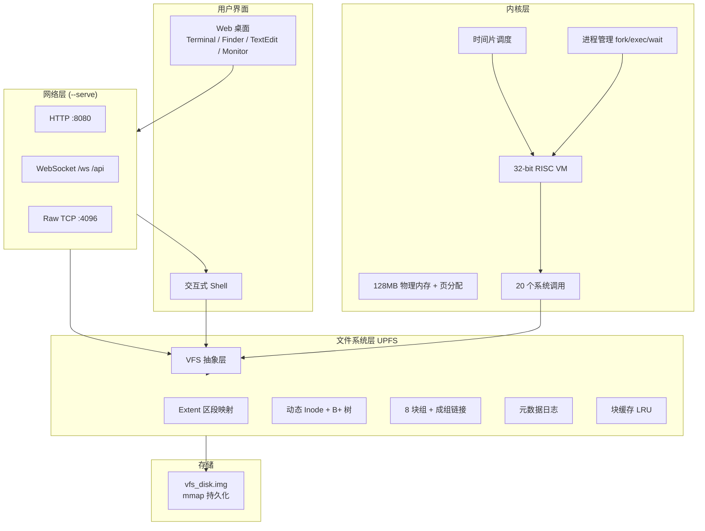

# UPFS 项目汇报文稿

> 建议汇报时长：**12～15 分钟**（含 3 分钟现场演示）  
> 适用场景：课程设计答辩、阶段验收、项目展示

---

## 一、开场（约 1 分钟）

**【讲稿】**

各位老师、同学好。我们小组的项目名称是 **UPFS**（UNIX 文件系统模拟器）。

本项目在宿主机上通过一块磁盘镜像，模拟完整的 UNIX 风格文件系统，并在其之上实现了进程管理、内存管理、虚拟机执行引擎和 Shell 交互界面。此外，我们还提供了 **Web 桌面管理界面**，可以在浏览器里完成终端操作、文件浏览、文本编辑和系统监控。

接下来我将从系统架构、核心模块、演示流程和开发难点四个方面进行介绍。

---

## 二、项目背景与目标（约 1.5 分钟）

**【讲稿】**

操作系统课程设计通常分别学习文件系统、进程调度、内存管理等知识点。我们的目标是把它们串成一条完整链路：**格式化磁盘 → 创建文件 → 编译用户程序 → 加载运行 → 持久化保存**。

具体目标包括：

1. **文件系统**：实现可挂载、可持久化的虚拟磁盘，支持目录树、权限、硬链接和日志恢复。
2. **内核模拟**：提供 32 位 RISC 虚拟机、进程表、页式内存和时间片轮转调度。
3. **用户接口**：Shell 命令、内置 C 编译器/汇编器、多用户登录。
4. **远程访问**：`--serve` 模式下通过 HTTP/WebSocket 提供 Web 桌面，便于展示和多人访问。

**技术栈**：C17、POSIX、pthreads、CMake；无第三方库依赖。

**规模概览**（可配合 PPT 表格）：

| 类别 | 数量 |
|------|------|
| Shell 命令 | 35+ |
| 系统调用 | 20 |
| VM 指令 | 21 |
| JSON API | 9 |
| 磁盘布局 | 546 块 × 512B |

---

## 三、总体架构（约 2 分钟）

**【讲稿】**

系统采用分层结构，自下而上分为：磁盘 I/O → 文件系统 → VFS → 内核 → Shell/网络服务 → Web 界面。



**要点说明：**

- 普通模式：用户在终端输入命令，直接调用 VFS 和内核。
- Serve 模式：父进程负责 HTTP/WebSocket，每个连接 fork 子进程；终端子进程跑 Shell，API 子进程处理文件读写和监控请求；磁盘镜像通过 mmap 在多进程间共享。

**各层主要源文件：**

| 层次 | 主要文件 |
|------|----------|
| 程序入口 | `src/main.c`（Shell、`--serve` 分支）、`src/serve.c`（网络服务） |
| Web 界面 | `src/web_page.h`（前端）、`src/web_api.c`（JSON API） |
| VFS | `src/fs/vfs.c`、`include/vfs.h` |
| 文件系统 | `src/fs/*.c`（见第四节对照表） |
| 内核 | `src/kernel/*.c`（见第五节对照表） |
| 用户管理 | `src/user/user_mgmt.c`、`src/user/env.c` |
| 工具链 | `src/assembler.c`、`src/compiler/*`、`src/editor.c` |
| 公共定义 | `include/vfs_core.h` |

---

## 四、文件系统设计与实现（约 3 分钟）

**【讲稿】**

这是本项目的核心部分，我们参考 ext2、XFS 等真实文件系统，做了几处关键设计。

### 4.1 磁盘布局

虚拟磁盘共 **546 块**（约 273KB）：

| 区域 | 块号 | 说明 | 实现文件 |
|------|------|------|----------|
| 引导块 | 0 | 魔数标识 | `src/fs/format.c` |
| 超级块 | 1 | 全局统计、块组表、Inode 映射根 | `include/vfs_core.h`（结构体）、`src/fs/allocator.c`（读写） |
| 块组区 | 2～513 | 8 组 × 64 块，数据 + Anchor | `src/fs/bg.c` |
| 日志区 | 514～545 | 32 块，元数据事务日志 | `src/fs/journal.c` |

底层读写与 mmap 持久化：`src/fs/disk_io.c`

### 4.2 块组与空闲管理

数据区划分为 **8 个块组**，每组 1 个 Anchor 块 + 63 个数据块。每组内部用 **成组链接法** 管理空闲块：栈满时将块号写入登记块形成链表。分配时优先在父 Inode 所在块组找空闲块，提高局部性。

| 功能 | 实现文件 |
|------|----------|
| 块组布局、Anchor 读写 | `src/fs/bg.c`、`src/fs/bg.h` |
| 块分配 `bg_balloc_for` / 回收 `bg_bfree` | `src/fs/bg.c` |
| 对外接口 `balloc` / `bfree` | `src/fs/allocator.c` |

### 4.3 动态 Inode（XFS 风格）

我们没有预留固定 Inode 区，而是按需分配 **Inode Chunk**（一个数据块存 16 个 Inode）。两棵 B+ 树维护映射：

- **Loc 树**：inode 号 → (chunk 块号, slot)
- **Chunk 树**：chunk 块号 → 16 位空闲掩码

叶节点满 63 条时自动分裂，理论可管理数千个文件。

| 功能 | 实现文件 |
|------|----------|
| Loc/Chunk B+ 树、inode 分配/释放 | `src/fs/inomap.c`、`src/fs/inomap.h` |
| 格式化时初始化 Inode 映射 | `src/fs/inomap.c`（`inomap_format_init`），由 `src/fs/format.c` 调用 |
| 内存 Inode 缓存 iget/iput | `src/fs/allocator.c` |

### 4.4 Extent 映射

文件数据块用 **Extent**（逻辑块号, 物理块号, 长度）描述，小文件只用内联 Extent，大文件建 B+ 树；相邻块自动合并，减少元数据开销。

| 功能 | 实现文件 |
|------|----------|
| Extent 查找、扩展、B+ 树 | `src/fs/extent.c`、`src/fs/extent.h` |
| 逻辑块到物理块映射 `extent_bmap` | `src/fs/extent.c` |

### 4.5 缓存、日志与并发

- **块缓存**：64 槽 LRU + 哈希，延迟写。
- **元数据日志**：超级块、Anchor、Inode Chunk 等关键块先写日志再提交；挂载时 `journal_replay` 恢复未完成事务。
- **Inode 缓存**：Hash + 引用计数 + 读写锁，支持多线程访问。

| 功能 | 实现文件 |
|------|----------|
| 块缓存 bread/bwrite/bcache_invalidate | `src/fs/buf.c`、`src/fs/buf.h` |
| 元数据日志 begin/commit/replay | `src/fs/journal.c`、`src/fs/journal.h` |
| mount/umount/sync/reload | `src/fs/allocator.c` |
| Inode 读写锁 | `src/fs/allocator.c` |

### 4.6 VFS 与文件操作

VFS 通过操作表分发到 UPFS 实现：`create/open/read/write/mkdir/namei/unlink` 等。用户打开文件表（20）→ 系统打开文件表（40）→ Inode 缓存，两层间接管理文件描述符。

| 功能 | 实现文件 |
|------|----------|
| VFS 操作表、mount/format 分发 | `src/fs/vfs.c`、`include/vfs.h` |
| 路径解析 namei、ls、mkdir、chdir | `src/fs/dir_sys.c`、`src/fs/dir_sys.h` |
| 文件 create/open/read/write/delete/cp/ln | `src/fs/file_sys.c`、`src/fs/file_sys.h` |
| 权限检查 | `src/fs/file_sys.c`（`vfs_access` 等） |
| format / mkfs | `src/fs/format.c`、`src/fs/format.h` |

---

## 五、内核与用户态（约 2.5 分钟）

**【讲稿】**

### 5.1 虚拟机

实现了 **32 位定长 RISC 指令集**（21 条）：算术、跳转、访存、CALL/RET、SYSCALL 等。用户程序编译为 **UPX** 格式：文件头 + text + data + bss + stack，由 `proc_exec` 加载到进程地址空间。

| 功能 | 实现文件 |
|------|----------|
| 取指-译码-执行、21 条指令 | `src/kernel/cpu.c`、`src/kernel/cpu.h` |
| UPX 加载、进程 exec | `src/kernel/process.c` |
| UPX 文件生成（汇编输出） | `src/assembler.c` |

### 5.2 内存与进程

- 物理内存 128MB，4KB 页，位图分配；每进程独立页表，最大 16MB 虚拟空间。
- 进程表最多 64 个 PCB；支持 fork（深拷贝页表）、exec、wait、exit。
- **时间片轮转**：每进程 100 条指令后切换。

| 功能 | 实现文件 |
|------|----------|
| 物理页分配、mem_read/write | `src/kernel/memory.c`、`src/kernel/memory.h` |
| PCB、fork/exec/wait/exit | `src/kernel/process.c`、`src/kernel/process.h` |
| 时间片轮转调度 | `src/kernel/scheduler.c`、`src/kernel/scheduler.h` |
| serve 模式共享内核状态 | `src/kernel/kernel_shared.c`、`src/kernel/kernel_shared.h` |

### 5.3 系统调用（20 个）

涵盖进程（exit/fork/exec/wait/getpid）、文件（open/read/write/close/create/delete/mkdir/chdir/stat）、内存（sbrk）、环境变量（getenv/setenv/unsetenv）。VM 内 SYSCALL 指令触发，由内核桥接到 VFS。

| 功能 | 实现文件 |
|------|----------|
| 系统调用分发表、VM 桥接 | `src/kernel/syscall.c`、`src/kernel/syscall.h` |

### 5.4 多用户与环境变量

- 用户账户存于 `/etc/passwd`，口令为盐值 + 万次迭代哈希。
- 支持 login/logout/su、owner/group/other 权限检查（root 免检）。
- 环境变量分系统级（`/etc/environment`）和用户级（`~/.env`）。

| 功能 | 实现文件 |
|------|----------|
| 用户账户、login、passwd | `src/user/user_mgmt.c`、`src/user/user_mgmt.h` |
| 环境变量 load/save/export | `src/user/env.c`、`src/user/env.h` |
| Shell 登录/切换命令 | `src/main.c`（`login`、`su`、`useradd` 等） |

### 5.5 工具链

- **汇编器**：两遍扫描，`.s` → `.upx`。
- **C 编译器**：词法/语法/AST/寄存器分配/代码生成，Shell 中 `cc` 命令桥接到宿主机编译再写回 VFS。
- **内置编辑器**：Shell 中 `vim` 命令，宿主机临时文件中转。

| 功能 | 实现文件 |
|------|----------|
| 两遍汇编器 | `src/assembler.c`、`src/assembler.h` |
| C 编译驱动 | `src/compiler/c2s.c`、`src/compiler/c2s.h` |
| 词法分析 | `src/compiler/lexer.c` |
| 语法分析 | `src/compiler/parser.c` |
| AST | `src/compiler/ast.c`、`src/compiler/ast.h` |
| 寄存器分配 | `src/compiler/regalloc.c` |
| 代码生成 | `src/compiler/codegen.c` |
| C 运行时（汇编库） | `src/compiler/runtime.s` |
| Shell `cc`/`asm` 命令（VFS↔宿主机桥接） | `src/main.c` |
| 内置 vim 编辑器 | `src/editor.c`、`src/editor.h` |
| 预置演示程序注入 | `src/binaries.c`、`src/binaries.h` |

---

## 六、Web 桌面与管理界面（约 2 分钟）

**【讲稿】**

运行 `./build/bin/OS_design --serve` 后，浏览器访问 `http://localhost:8080`。

**界面组成：**

- 启动过渡页：`Understand Problems, Find Solutions.` 打字动画
- 菜单栏 + Dock + 可拖拽窗口
- 深浅主题切换

**四个应用：**

| 应用 | 功能 | 后端 | 实现文件 |
|------|------|------|----------|
| Terminal | 多标签命令行，ANSI 彩色输出 | WebSocket `/ws/N` | 前端 `src/web_page.h`；后端 `src/serve.c` + `src/main.c`（`upfs_session`） |
| Finder | 目录树、右键菜单、双击打开 | JSON API `/api` | 前端 `src/web_page.h`；API `src/web_api.c`（`cmd_ls` 等） |
| TextEdit | 打开/编辑/保存文本文件 | JSON API `cat`/`write` | 前端 `src/web_page.h`；API `src/web_api.c`（`cmd_cat`、`cmd_write`） |
| Activity Monitor | 超级块、块组、进程、内存 | JSON API `debug` | 前端 `src/web_page.h`；API `src/web_api.c`（`cmd_debug_*`） |

**网络与进程模型：**

| 功能 | 实现文件 |
|------|----------|
| HTTP/WebSocket/TCP 服务、`--serve` 入口 | `src/serve.c`、`src/serve.h` |
| 共享磁盘路径（多进程） | `src/serve.c`（`shared_set_disk`） |
| JSON API 会话 | `src/web_api.c`（`upfs_api_session`） |
| 终端会话（Web/raw TCP） | `src/main.c`（`upfs_session`） |
| 跨进程元数据同步 | `src/fs/allocator.c`（`fs_reload_super`、`fs_sync_disk`） |

**API 示例：**

```json
{"cmd":"ls","path":"/src"}
{"cmd":"write","path":"/src/hello.c","data":"..."}
{"cmd":"debug","type":"process"}
```

前端 HTML/CSS/JS 全部内嵌在 `web_page.h`，无外部依赖。原始终端仍可通过 `nc localhost 4096` 连接。

**多进程一致性**：API 子进程与终端子进程各自有块缓存和 Inode 缓存，通过每次操作前 reload 超级块、写盘后 flush 缓存和持久化 superblock，保证 Web 编辑与 Shell 命令看到同一份磁盘状态。

---

## 七、现场演示脚本（约 3 分钟）

**【建议操作顺序，可边讲边做】**

### 7.1 启动 Web 界面

```bash
./build/bin/OS_design --serve
# 浏览器打开 http://localhost:8080
```

讲解：启动动画 → 桌面 → 打开 Terminal 窗口。

### 7.2 初始化文件系统

在 Web 终端输入：

```
format
# 创建用户 test / 设置密码
ls /
```

讲解：format 创建块组、Inode 映射、根目录；自动注入 `/src` 示例源码和 `/bin` 演示程序。

> 涉及文件：`src/main.c`（`shell_format`）→ `src/fs/format.c`、`src/fs/inomap.c`、`src/binaries.c`

### 7.3 文件与编辑

1. 打开 **Finder**，展开 `/src`，查看示例 `.c` 文件。
2. 打开 **TextEdit**，路径填 `/src/demo.c`，写入简单 C 程序并 **Save**。
3. 回到终端：`cat /src/demo.c` 确认内容一致。

### 7.4 编译与运行

```
cc /src/demo.c /bin/demo
run /bin/demo
```

讲解：`cc` 导出到宿主机编译、汇编，生成 UPX 写回 `/bin`；`run` 加载 UPX 在 VM 中执行。

> 涉及文件：`src/main.c`（`cc`、`run`）→ `src/compiler/c2s.c`、`src/assembler.c`、`src/kernel/process.c`、`src/kernel/cpu.c`

### 7.5 监控

打开 **Activity Monitor**，展示 Inode 使用、块组柱状图、进程列表、内存热力图。

### 7.6 持久化（可选，时间充裕时）

```
umount
exit
# 重启程序 → mount → login → cat /src/demo.c
```

讲解：数据写入 mmap 镜像，重启后仍可恢复。

---

## 八、开发难点与解决（约 2 分钟）

**【讲稿】**

开发过程中遇到的主要问题如下。

### 8.1 多进程下的 Inode 重复分配

**现象**：TextEdit 新建文件后，在终端 `cc` 编译，源文件大小变成二进制大小。

**原因**：API 进程创建 Inode 后，终端进程的 `s_inode_next` 计数与磁盘 Loc 树不同步；重复分配同一 inode 号，写入输出时覆盖了源文件。

**解决**（涉及文件）：
- 分配 inode 前跳过 Loc 树中已占用的编号 → `src/fs/inomap.c`
- `loc_insert` 遇到重复 inode 返回错误 → `src/fs/inomap.c`
- 每次 sync 强制写回 superblock → `src/fs/allocator.c`（`fs_sync_superblock`）

### 8.2 Web 与终端的数据一致性

**现象**：TextEdit 保存后，终端 `ls` 看不到新文件；或 size/mode 显示异常。

**原因**：子进程各自维护块缓存，脏数据未 flush 到 mmap 磁盘。

**解决**（涉及文件）：
- `fs_sync_disk` 写 Inode/superblock 后多次 flush → `src/fs/allocator.c`
- `bcache_invalidate` 先 flush 再清 VALID → `src/fs/buf.c`
- 每条命令前 `fs_reload_super` → `src/fs/allocator.c`；调用处 `src/main.c`、`src/web_api.c`

### 8.3 二进制文件与终端崩溃

**现象**：`cat` 编译后的 `.upx` 文件导致 Web 终端 session 断开。

**原因**：二进制含 `\0` 和控制字符，破坏 WebSocket 输出。

**解决**（涉及文件）：
- Shell `cat` 二进制检测 → `src/main.c`（`file_is_binary`、`cmd_cat`）
- API `cat` 拦截 → `src/web_api.c`（`api_file_is_binary`）

### 8.4 编译输出覆盖源文件

**现象**：`cc` 若输出路径与源路径相同，源文件被二进制覆盖。

**解决**（涉及文件）：
- 路径规范化与同源检测 → `src/main.c`（`normalize_vfs_path`、`paths_same`）
- 覆盖写替代 delete+create → `src/main.c`（`vfs_write_bytes`）

---

## 九、总结（约 1 分钟）

**【讲稿】**

UPFS 实现了从虚拟磁盘到用户程序的完整链路：

- **文件系统**：块组、动态 Inode、Extent、日志、块缓存；
- **内核**：VM、进程、调度、系统调用、IPC；
- **用户态**：Shell、多用户、C 工具链；
- **网络界面**：Web 桌面，终端 + 文件管理 + 文本编辑 + 监控。

项目全部用 C 实现，约 15000 行代码，可在 macOS/Linux 上编译运行，适合作为操作系统课程的综合设计案例。

**后续可改进方向**（如被问到）：WebSocket 优雅关闭、更完整的 C 语言支持、Extent 大文件性能测试、真正的多用户并发写锁粒度优化。

谢谢各位，欢迎提问。

---

## 十、附录：分工建议（三人组）

| 成员 | 汇报段落 | 负责模块 | 主要文件 |
|------|----------|----------|----------|
| 成员 A | 开场、背景、总结 | Shell、用户管理、工具链 | `src/main.c`、`src/user/*`、`src/assembler.c`、`src/compiler/*`、`src/editor.c` |
| 成员 B | 文件系统（第四节） | fs/、VFS | `src/fs/*`、`include/vfs_core.h` |
| 成员 C | 内核 + Web（第五、六节） | kernel/、serve、Web | `src/kernel/*`、`src/serve.c`、`src/web_page.h`、`src/web_api.c` |

演示时一人操作、一人讲解，第三人准备答疑。

---

## 附录 A：功能与源文件完整对照表

### A.1 Shell 命令

| 命令 | 功能 | 实现文件 |
|------|------|----------|
| `format` | 格式化磁盘 | `src/main.c`（`shell_format`）→ `src/fs/format.c` |
| `mount` / `umount` | 挂载/卸载 | `src/main.c` → `src/fs/allocator.c` |
| `mkdir` / `cd` / `pwd` / `ls` | 目录操作 | `src/main.c` → `src/fs/dir_sys.c` |
| `create` / `write` / `cat` / `rm` / `cp` / `ln` / `stat` / `chmod` | 文件操作 | `src/main.c` → `src/fs/file_sys.c`、`src/fs/dir_sys.c` |
| `useradd` / `login` / `logout` / `su` / `whoami` / `passwd` / `users` | 用户管理 | `src/main.c` → `src/user/user_mgmt.c` |
| `env` / `export` / `unset` | 环境变量 | `src/main.c` → `src/user/env.c` |
| `asm` / `cc` | 汇编/编译 | `src/main.c` → `src/assembler.c`、`src/compiler/c2s.c` |
| `run` / `ps` / `kill` | 进程管理 | `src/main.c` → `src/kernel/process.c`、`src/kernel/scheduler.c` |
| `mkfifo`、管道 `\|` | 管道 | `src/main.c` → `src/kernel/pipe.c` |
| `vim` | 文本编辑 | `src/main.c` → `src/editor.c` |
| `design_debug` | 调试输出 | `src/main.c` → `src/fs/allocator.c` 等 |
| `help` / `clear` / `exit` | 辅助 | `src/main.c` |

命令分发总入口：`src/main.c` 的 `dispatch_command()`。

### A.2 JSON API（Web 端）

| API 命令 | 功能 | 实现文件 |
|----------|------|----------|
| `ls` | 列目录 | `src/web_api.c`（`cmd_ls`）→ `src/fs/dir_sys.c` |
| `stat` | 文件属性 | `src/web_api.c`（`cmd_stat`） |
| `cat` | 读文件 | `src/web_api.c`（`cmd_cat`）→ `src/fs/file_sys.c` |
| `write` | 写文件 | `src/web_api.c`（`cmd_write`）→ `src/fs/file_sys.c`、`src/fs/extent.c` |
| `mkdir` / `create` / `rm` | 目录/文件管理 | `src/web_api.c` |
| `debug`（super/process/memory） | 监控数据 | `src/web_api.c` |

API 入口：`src/web_api.c` 的 `upfs_api_session()`、`dispatch()`。

### A.3 内核与 IPC

| 功能 | 实现文件 |
|------|----------|
| 匿名管道 | `src/kernel/pipe.c` |
| 命名管道 mkfifo | `src/kernel/pipe.c`、`src/main.c` |
| 共享内存 / 信号 IPC | `src/kernel/ipc.c`、`src/kernel/ipc.h` |

### A.4 构建与配置

| 功能 | 实现文件 |
|------|----------|
| CMake 构建 | `CMakeLists.txt` |
| Makefile（备选） | `Makefile` |

---

## 十一、附录：常见提问与参考回答

**Q1：为什么磁盘只有 273KB，够用吗？**

课程设计侧重机制验证而非容量。546 块足够演示格式化、B+ 树分裂、日志回放、多文件创建和编译运行。Extent 和动态 Inode 的设计可扩展到更大磁盘。

**Q2：和真实 ext4/XFS 有什么区别？**

我们借鉴了 ext2 块组、XFS 动态 Inode 和 Extent 映射的思想，但简化了：无 journal 的完整 redo/undo、无 extent 预分配、无延迟分配和 dir index 等生产级特性。

**Q3：serve 模式下多个终端会冲突吗？**

磁盘通过 mmap 共享，元数据有日志保护；但各子进程有独立块缓存，依赖 reload + sync 保持一致。适合演示，不等同于生产级多机文件系统。

**Q4：C 编译器支持到什么程度？**

支持基本语法：变量、函数、if/while、表达式、部分标准库通过 runtime.s 桥接。复杂特性（结构体指针运算、浮点等）尚未完整支持。

**Q5：用户程序如何访问文件？**

通过 SYSCALL：OPEN/READ/WRITE/CLOSE 等，内核侧调用 VFS，VFS 再调用 UPFS 的 read/write。

**Q6：为什么用 Web 界面而不是纯终端？**

便于课程展示和验收：可视化目录树、在线编辑、监控仪表盘，降低演示门槛；原始终端（4096 端口）仍保留。

---

## 十二、PPT 页码建议（共 15～18 页）

1. 封面：项目名称、成员、日期  
2. 目录  
3. 项目背景与目标  
4. 总体架构图 + **源文件分层表**（第三节末）  
5. 磁盘布局  
6. 块组 + 成组链接法（示意图）  
7. 动态 Inode + B+ 树  
8. Extent 映射  
9. 日志与块缓存  
10. 内核：VM + 进程 + 调度  
11. 系统调用一览  
12. Web 桌面截图（Terminal / Finder / TextEdit / Monitor）  
13. 演示流程（命令列表）  
14. 难点与解决（表格 + 源文件）  
15. **附录 A：功能-文件对照表**（可选单独一页或发讲义）  
16. 总结与展望  
17. Q&A  

---

*文档版本：与当前代码库同步（含 Web 桌面、TextEdit、多进程 sync 修复）*
